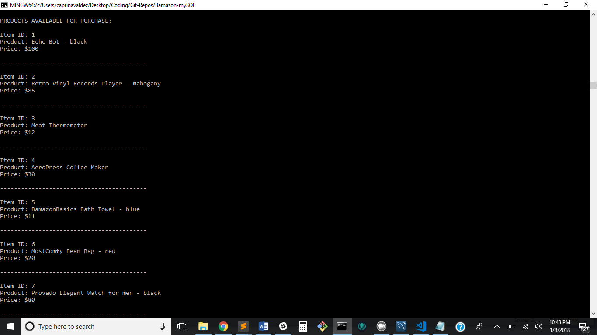
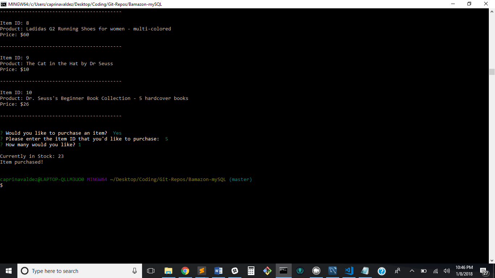
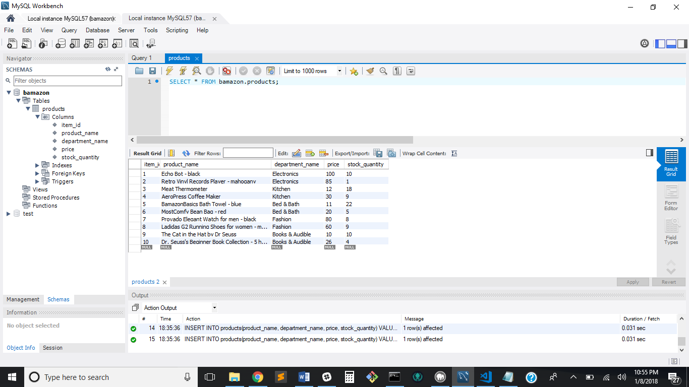
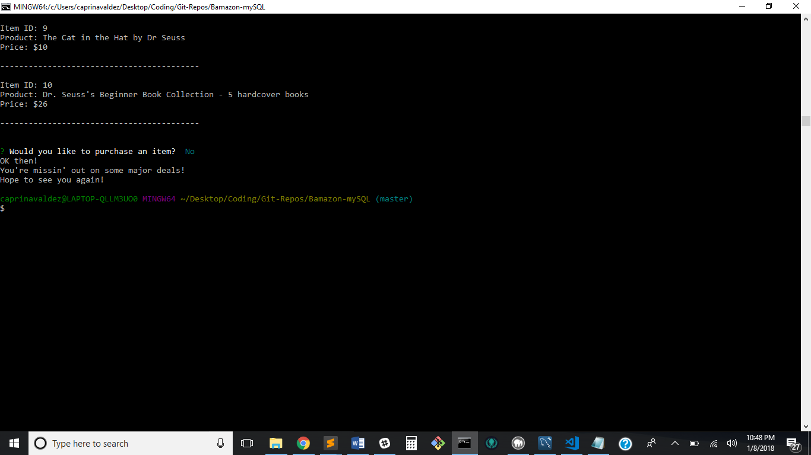
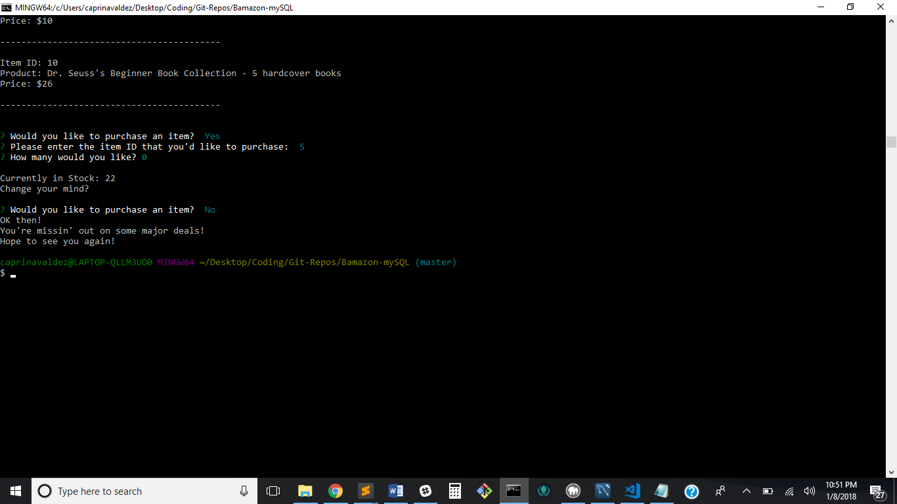
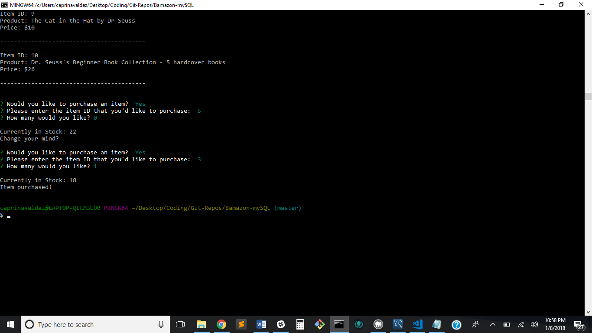

# Bamazon-mySQL Application

## An Amazon-like Application using mySQL and NodeJS

### When the application is run, it will first display all the products available for purchase

### It then asks the user if they'd like to purchase an item.

### If yes, it prompts the user to enter:
* The item ID that they want
* The quantity they want

### Once user input is complete, it checks the MySQL database to see if the chosen item is in stock.
## If yes, informs user that the item has been purchased.

## And it will also update the database's stock quantity

### If user does NOT want to purchase any items, it will show a message and connection will end.

### If user decides halfway that they do not want the item anymore or wants to change their item then it will resort back to the initial question.

